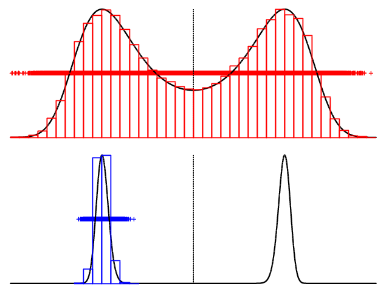
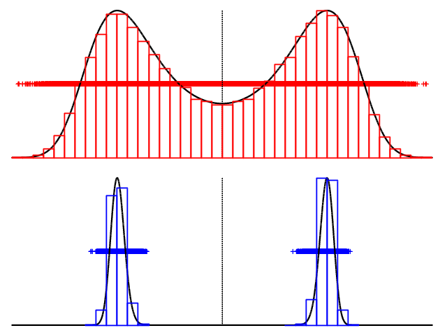

# MPI_MC3
Metropolis coupled Markov chain Monte Carlo sampler using the Random Walk 
Metropolis-Hastings algorithm using MPI implementation.

MC³ offers a way to optimize sampling from related distributions by exchanging 
replicas. This helps amongst others to explore local minima.

Sampling in this implementation is MPI parallel. However, the coupling does require 
processes (samplers) to be synchronised. This could be reduced to synchronisation every
n-th sample.

## Compilation and running

The program can be compiled with either ``mpic++`` or CMake. Running is done 
through ``mpi_exec -n 2`` (only two processes for now).

## Example with double potential well

**without coupling**

We use the double potential well target function (the idea is from 
[Darren Wilkinson's research blog](https://darrenjw.wordpress.com/2013/09/29/parallel-tempering-and-metropolis-coupled-mcmc/)). 
We sample the distributions gamma = 1 and gamma = 30.

The sampler settings are the following for uncoupled sampling:

    // Settings for the sampler
    #define STARTING_SAMPLE -1.0
    #define LOWLIMU 0.0
    #define UPPLIMU 1.0
    #define COUPLING false
    #define COUPLING_INTERVAL 100
    #define PROPOSALS 100000
    #define WALKSTEP0 0.5
    #define WALKSTEP1 0.05
    
Because the distribution with gamma = 30 has such strong misfit gradients, a much 
smaller RWMH stepsize is needed.

One resulting multidimensional chain (Sampling is performed at the same time, 
hence multidimensional. They are not yet coupled!) is given in the following figure, 
where black lines indicate the true pdf, and the histograms the Markov Chains:

As can be seen, the low barrier (top) distribution is well sampled. On the bottom, 
the distribution with the strong barrier, is only sampled near its starting point.

**with coupling**
    
Now, enabling Metropolis coupling:

    // Settings for the sampler
    #define STARTING_SAMPLE -1.0
    #define LOWLIMU 0.0
    #define UPPLIMU 1.0
    #define COUPLING true                <---- this changed
    #define COUPLING_INTERVAL 100
    #define PROPOSALS 100000
    #define WALKSTEP0 0.5
    #define WALKSTEP1 0.05
    
This gives the following result:

Where both minima of the lower distribution are well sampled.